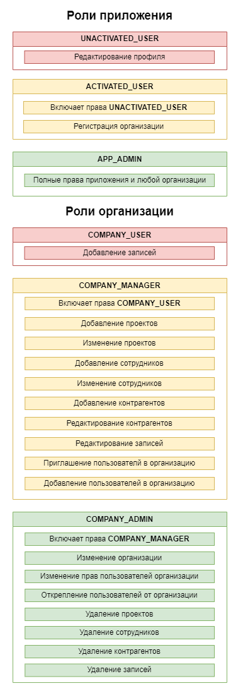

# RecordKeepingSpring
Веб-приложение для учета входящей и исходящей корреспонденции.

### TODO
- [X] Структура БД
- [X] Регистрация и аутентификация
- [X] Отправка Email пользователям
- [X] Подтверждение адреса электронной почты
- [ ] Регистрация Организации
- [ ] Редактирование профиля организации
- [ ] Привязка пользователя к организации
- [ ] Раздача прав пользователям
- [ ] Добавление и редактирование проектов
- [ ] Добавление и редактирование сотрудников (не являющихся пользователями приложения)
- [ ] Редактирование профиля пользователя
- [ ] Сброс пароля
- [ ] Отправка инвайтов для приглашения сотрудника
- [ ] Добавление и редактирование проектов
- [ ] Добавление записей
- [ ] Прикрепление файлов к записи
- [ ] Вывод записей
- [ ] Фильтрация записей

### Роли приложения и организаций по умолчанию

### Database diagram
[Схема таблиц БД на dbdiagram.io](https://dbdiagram.io/d/62cd609ccc1bc14cc5a16f38)